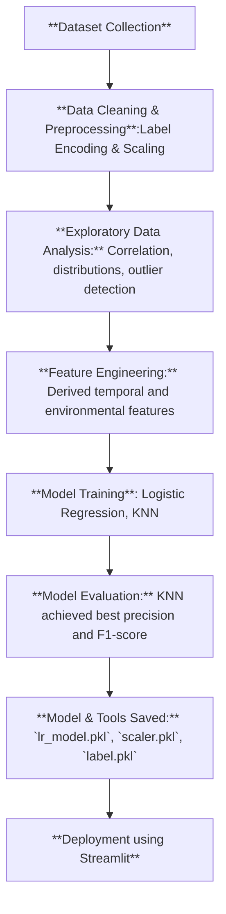

# 🌡️ Heatwave Severity & Duration Prediction
**_Predicting Heatwave Severity and Expected Duration Using Machine Learning_**

      

---

## 📘 Overview
Heatwaves are increasingly affecting regions worldwide, posing health and environmental risks. This project aims to **predict the severity** of a heatwave (*Mild, Moderate, Severe*) and **expected duration** based on climate and environmental parameters using machine learning.  
The solution provides actionable insights for planning and early warnings, making it a practical tool for weather monitoring and disaster management.

---

## 📂 Dataset
- **Source:** Publicly available climate datasets :- Kaggle (temperature, precipitation, wind speed, etc.)  
- **Features Used:**  
  `city`, `temperature_2m_max`, `temperature_2m_min`, `apparent_temperature_max`, `apparent_temperature_min`, `precipitation_sum`, `rain_sum`, `wind_speed_10m_max`, `Year`, `Month`, `Day`  
- **Data Preparation:**  
  - Removed missing or inconsistent values  
  - **Label Encoding** for categorical column `city`  
  - **StandardScaler** applied to numerical features  
  - Created target column **Severity** for classification  

---

## ⚙️ Prerequisites / Tools & Libraries 
**Programming Language:** Python 3.12.8  
**Environment:** Visual Studio Code  
**Libraries:**  pandas, numpy, matplotlib, seaborn, scikit-learn, joblib, streamlit

---

## 🧩 Methodology / Workflow

---

## 🚀 Results & Deployment
- Deployed using **Streamlit** for real-time prediction  
- Users select a city, date, and input environmental features to predict heatwave severity and duration

  

---

## 💡 Future Scope 
- Extend predictions for regional or global heatwave analysis  
- Incorporate deep learning models for time-series predictions  
- Integrate with dashboards for public awareness and policymaking  

---

## 📜 Conclusion
Developed an ML-based solution to classify heatwave severity and duration.Visualizations provide insights for decision-making, can be extended to more complex datasets and models in the future.  

---

## 👩‍💻 Author
Keerthana Bommera. 
 
---

## 🪪 License
This project is licensed under the **MIT License**.

